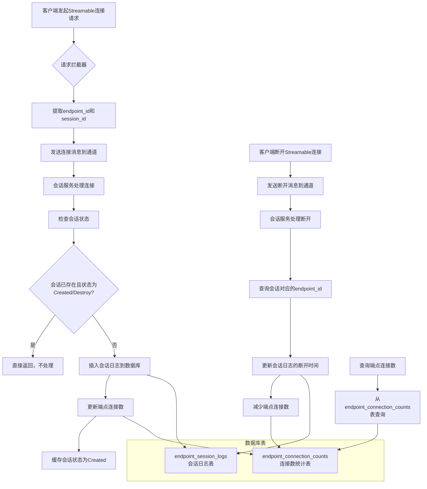
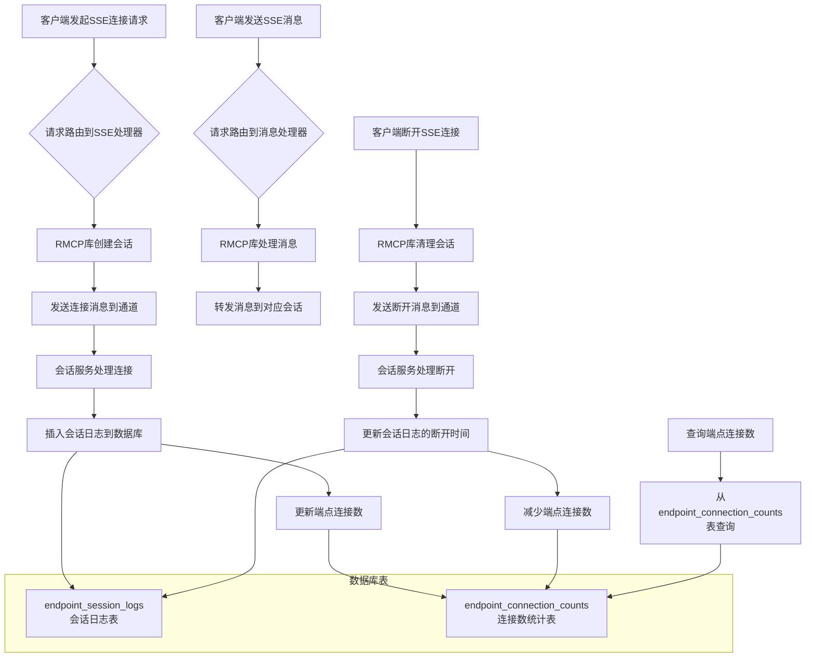

# Mcp session统计逻辑

## streamable

```mermaid
graph TD
    A[客户端发起Streamable连接请求] --> B{请求拦截器}
    B --> C[提取endpoint_id和session_id]
    C --> D[发送连接消息到通道]
    D --> E[会话服务处理连接]
    E --> F[检查会话状态]
    F --> G{会话已存在且状态为Created/Destroy?}
    G -->|是| H[直接返回，不处理]
    G -->|否| I[插入会话日志到数据库]
    I --> J[更新端点连接数]
    J --> K[缓存会话状态为Created]
    
    L[客户端断开Streamable连接] --> M[发送断开消息到通道]
    M --> N[会话服务处理断开]
    N --> O[查询会话对应的endpoint_id]
    O --> P[更新会话日志的断开时间]
    P --> Q[减少端点连接数]
    
    R[查询端点连接数] --> S[从endpoint_connection_counts表查询]
    
    subgraph 数据库表
        T[endpoint_session_logs<br/>会话日志表]
        U[endpoint_connection_counts<br/>连接数统计表]
    end
    
    I --> T
    P --> T
    J --> U
    Q --> U
    S --> U
```

## sse

```mermaid
graph TD
    A[客户端发起SSE连接请求] --> B{请求路由到SSE处理器}
    B --> C[RMCP库创建会话]
    C --> D[发送连接消息到通道]
    D --> E[会话服务处理连接]
    E --> F[插入会话日志到数据库]
    F --> G[更新端点连接数]
    
    H[客户端发送SSE消息] --> I{请求路由到消息处理器}
    I --> J[RMCP库处理消息]
    J --> K[转发消息到对应会话]
    
    L[客户端断开SSE连接] --> M[RMCP库清理会话]
    M --> N[发送断开消息到通道]
    N --> O[会话服务处理断开]
    O --> P[更新会话日志的断开时间]
    P --> Q[减少端点连接数]
    
    R[查询端点连接数] --> S[从endpoint_connection_counts表查询]
    
    subgraph 数据库表
        T[endpoint_session_logs<br/>会话日志表]
        U[endpoint_connection_counts<br/>连接数统计表]
    end
    
    F --> T
    P --> T
    G --> U
    Q --> U
    S --> U
```