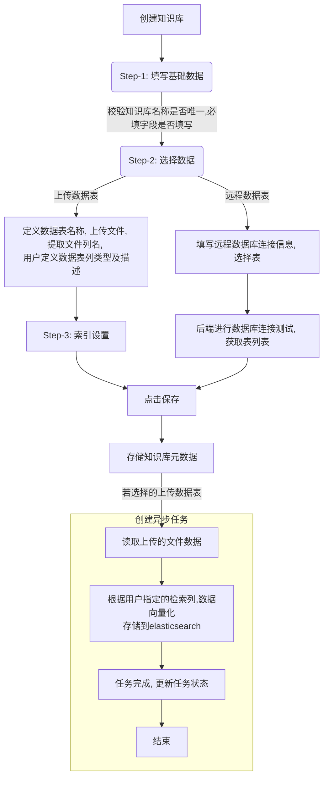
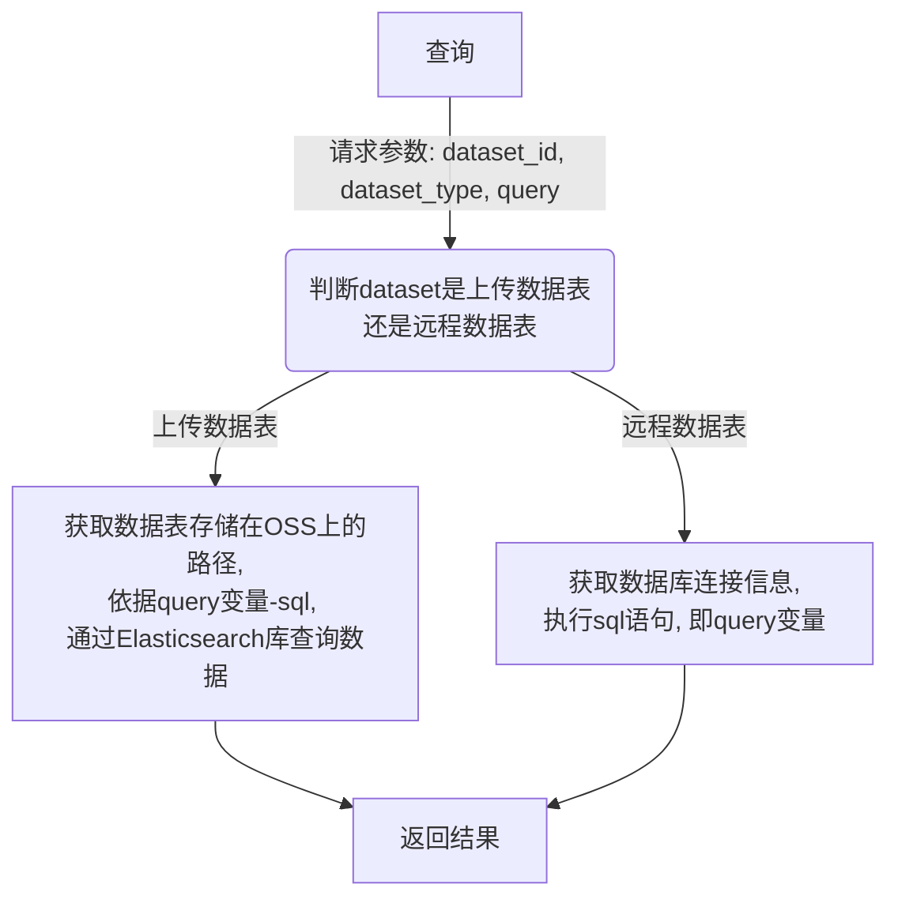
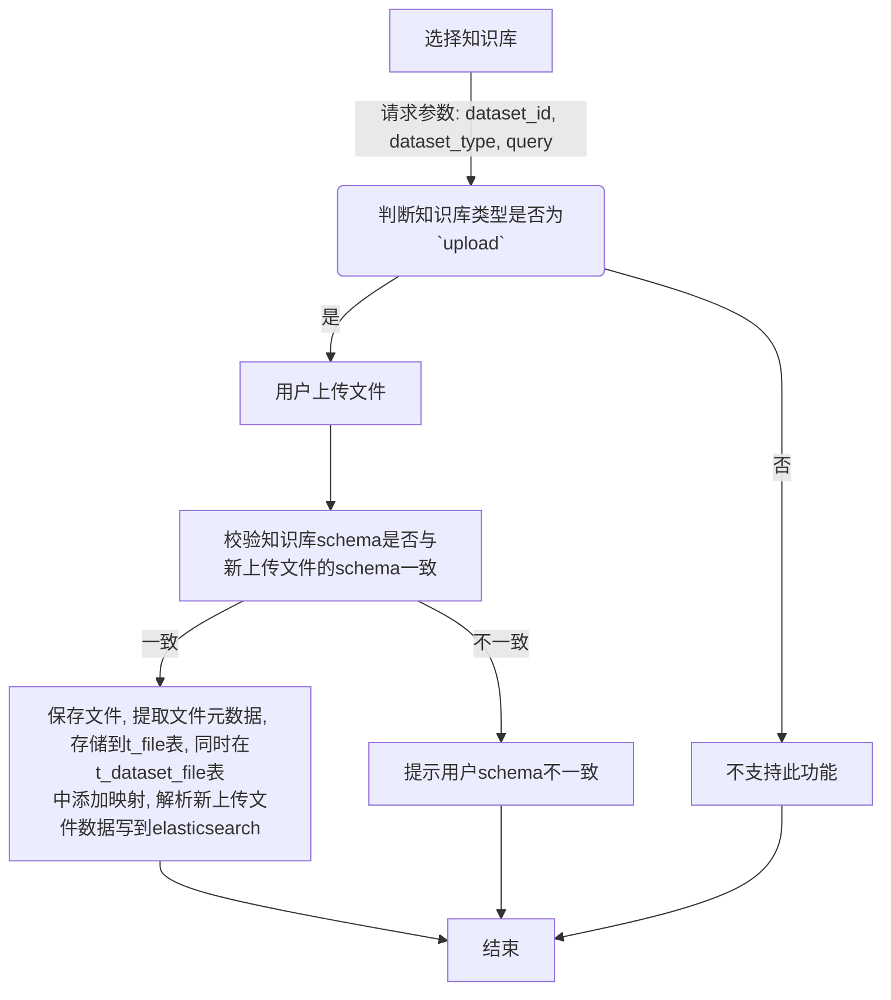

# 数据表RAG

本项目旨在构建一个高效、可扩展的知识库管理系统。核心目标是允许用户通过上传结构化的Excel/CS文件，灵活定义知识库的
虚拟表结构（Schema），并将数据持久化至Elasticsearch以支持强大的全文检索和向量检索。
系统强调用户对检索方式的动态控制能力，并利用现代Rust技术栈确保高性能与高可靠性


## 业务逻辑
### 创建知识库流程

> 每个文件创建一个异步任务

### 检索知识库数据流程


### 已存在的知识库,继续上传数据
> 此功能只对`上传数据表`(upload)类型知识库开放

> 流程中: 读取文件数据、向量化、数据存储到es由异步任务完成


### 后端技术栈
```shell
# 存储、读取阿里云OSS
cargo add opendal 

# 读取excel、csv数据
cargo add calamine 
cargo add csv 
```

阿里云bucket参数在配置文件中可配置(config/default.toml)


## 注意事项
* 前端页面组件使用shadcn组件
* 创建的后端数据表需可通过migrations自动升级
* 前端页面高度还原markdown中的图片
* 后端功能完成后需有单元测试