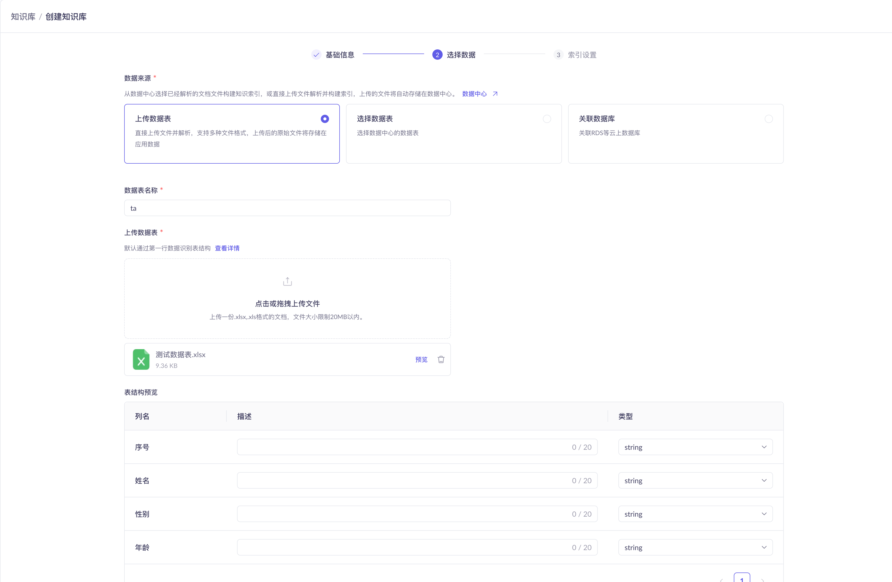
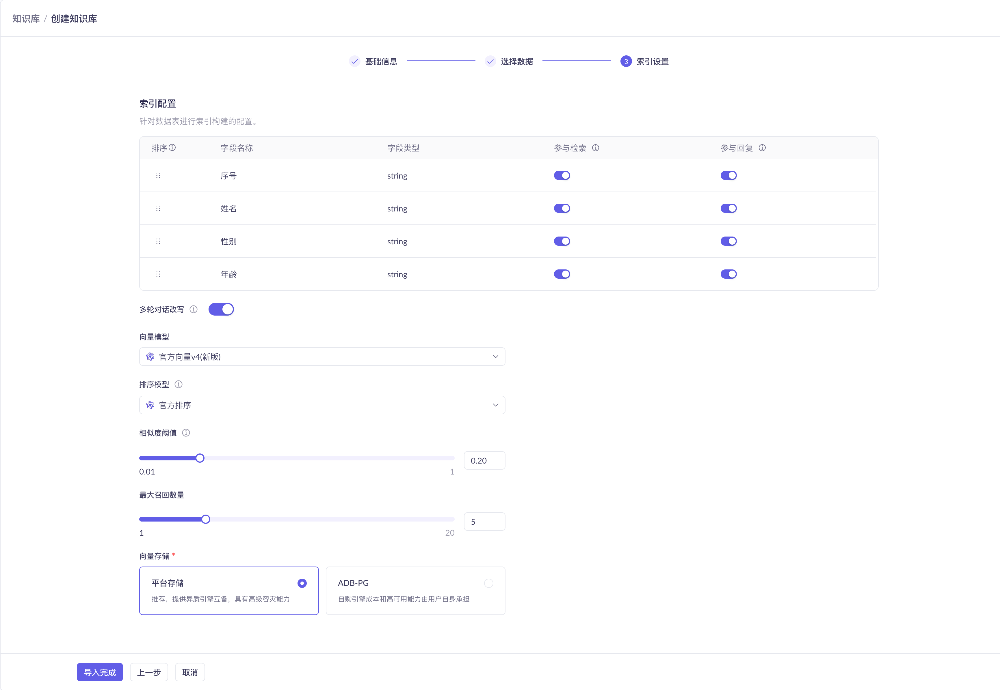
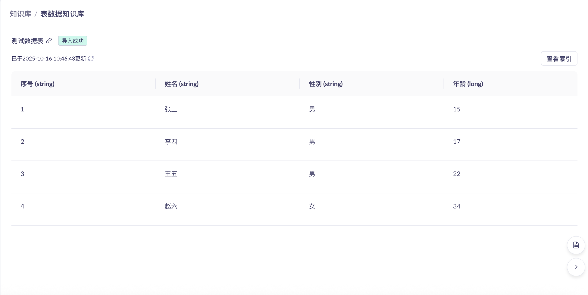

## 前端页面

### 创建知识库

* 知识库名称(必填字段): 校验唯一
* 知识库描述(可选)
* 知识库类型(默认:数据查询, 有且只有该一个选项)

### 选择数据

* 数据来源(Choice Card实现)
    * 上传数据表: 支持excel、csv文件类型
        * 通过用户上传文件,自动解析文件里数据表schema
        * 表结构预览: 最终结果对应`t_dataset`表的`schema`字段
    * 远程数据表
        * 数据库类型: mysql
        * host: input框
        * port: input框(只支持数字)
        * username: input框
        * password: input框
        * database: input框
        * table: 用户填写完上述内容, 自动查询出table列表（select框, 单选, Combobox组件实现）

* 数据表名称(必填)
    * 上传数据表: 用户自定义
    * 数据库数据表: 默认查询的实际表名,也可用户自定义

* 表结构预览功能
    * 列名:
        * 上传数据表: 自动解析文件中schema
        * 数据库数据表: 通过连接数据库,读取schema
    * 描述:用户选填
    * 类型:支持string,long,double,datatime(yyyy-MM-dd HH:mm:ss)

### 索引设置

#### 上传数据表

##### 页面选择项
* 索引配置: 展示表schema
    * 字段名称
    * 字段类型
    * 参与检索: 开启后表示在此列数据中进行搜索
    * 参与回复: 开启后表示被搜索到的数据行对应的本列数据提取出来给到大模型进行生成
* 向量模型(Field组件实现)
    * 给出提示信息: 默认是`text-embedding-v4`
* 相似度阈值(0.00 ~ 1.00, 滑动条实现): 设定最低分数标准，只有超过这个阈值的检索结果才会被考虑用于后续的生成过程
* 最大召回数量(1 ~ 20): 滑动条实现

#### 远程数据表
无索引设置

## 知识库列表

* 页面右上角: 创建知识库按钮
* 每个知识库由一个面板展示: 鼠标移动到知识库面板, 面板上展示查看详情按钮和编辑知识库, 点击查看详情, 可跳转到知识库详情；点击编辑，跳转到知识库编辑页

## 知识库详情

* 详情页展示表格数据, 默认展示前20条数据

## 知识库编辑

* 可修改属性
  * 知识库名称
  * 描述
  * 相似度阈值

## 步骤业务逻辑
创建知识库时，只有最后一个步骤确定后才调用后端接口保存数据，每个步骤可以返回前一个步骤，且当前步骤已填写的数据不会清空
* 步骤一: 填写基础信息
* 步骤二: 选择数据
* 步骤三: 索引设置
> 每个步骤跳转时, 不请求后端接口
