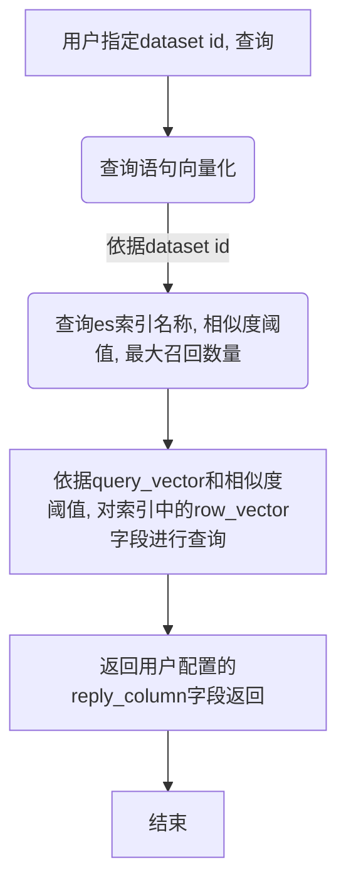

## Elasticsearch 索引结构设计

```json
{
  "file_name": "",
  "sheet": "",
  "row_vector": [],
  "column-1": "",
  "column-2": "",
  "column-3": "",
  ...
}

```
### 索引名称
datetime_uuid_vector
> datatime格式: yyyyMMddHHmmss
> uuid去除'-', 且生成的索引名需保存到mysql(t_dataset.table_name字段)

### 字段说明
- file_name: 文件名称
- sheet: 针对excel文件的sheet名称, 针对不提供sheet或没有的文件该字段为空字符串
- row_vector: 每列数据拼接后的向量值
  - 每列键值对拼接, 键值对之间用' \n\n'分隔
  > 示例: 列名-1: value1 \n\n列名-2: value2 \n\n列名-3: value3
  - 根据用户选择的参与检索列拼接

- column: 每列数据对应值, 根据实际数据值定义字段类型
- 最终elasticsearch索引mapping需保存到mysql(t_dataset.index_mapping)

### 查询
依据用户指定参与返回的列返回数据



## 其他补充项
* mysql表t_dataset新增列，如下:
```sql
ALTER TABLE t_dataset ADD COLUMN retrieval_column text DEFAULT '' COMMENT '参与检索列,多个列用逗号分隔';
ALTER TABLE t_dataset ADD COLUMN reply_column text DEFAULT '' COMMENT '参与回复列,多个列用逗号分隔';
ALTER TABLE t_dataset ADD COLUMN max_results int(5) DEFAULT '3' COMMENT '召回数量';
ALTER TABLE t_dataset ADD COLUMN similarity_threshold double DEFAULT '0.1' COMMENT '相似度阈值';
```