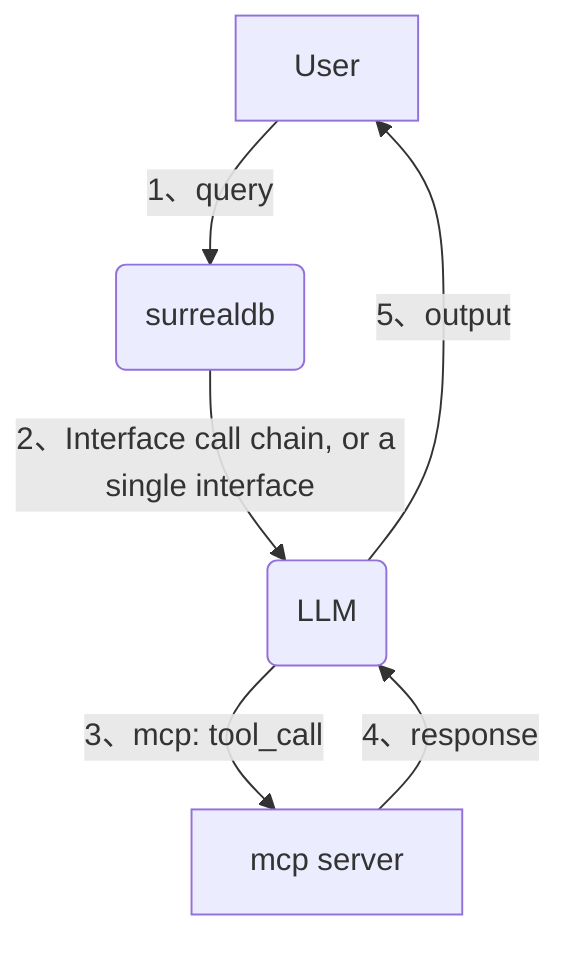
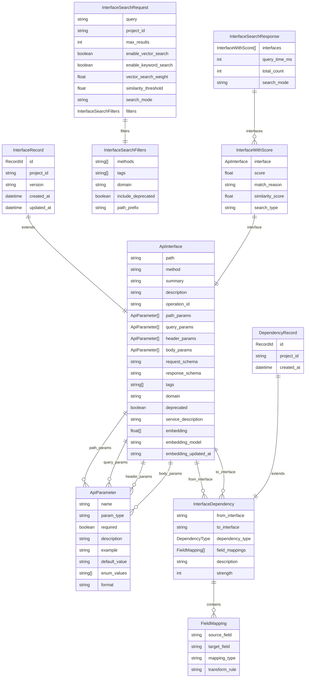
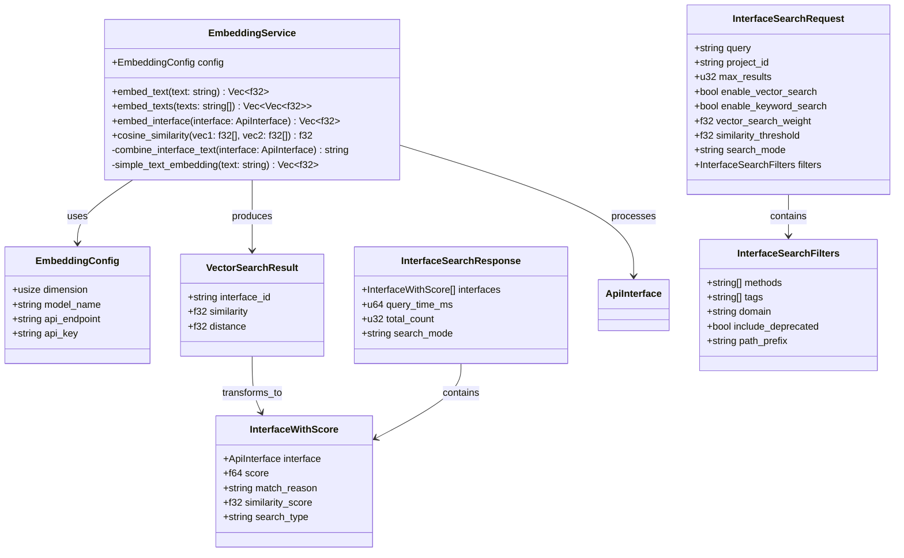
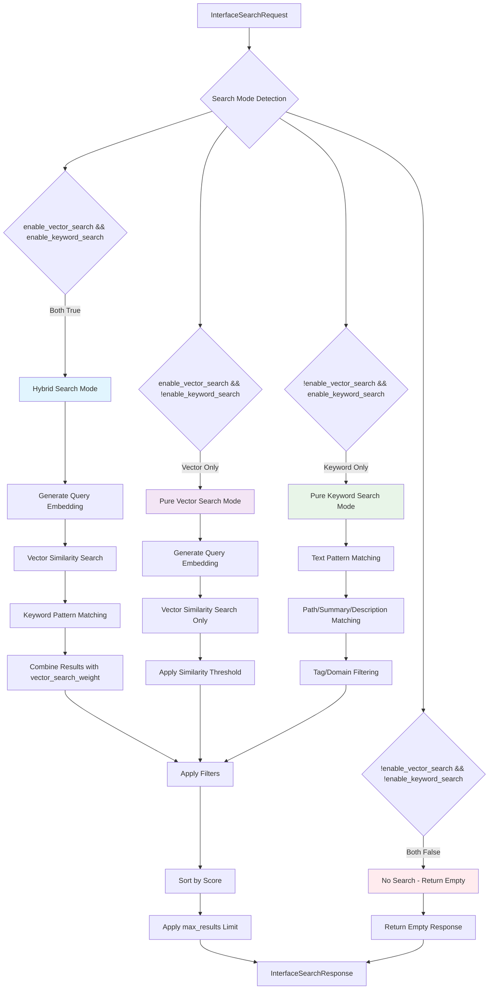
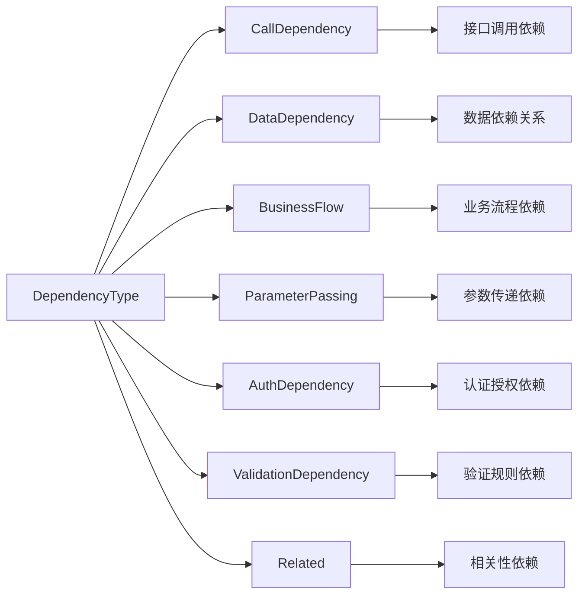

# 梳理接口、字段依赖关系

## 背景

公司接口成百上千，LLM需要准确识别用户意图从而精确调用相关接口，可能是单个接口，也可能多个（接口之间有依赖关系）；

- 所有接口描述信息放到提示词，占用输入token（甚至可能无法完全填入）
- 接口太多，LLM识别准确率低
- LLM无法知道接口之间依赖关系，需要多步询问用户，效率低下

## 解决方案

- 通过LLM识别项目中的接口（也可直接提供swagger文档），梳理业务逻辑以及底层数据表关联关系，输出关系文档（接口、字段、依赖关系、字段处理逻辑、描述）
- 关系文档存入图数据库
- 依据用户问题，检索相关字段及接口，返回单个或多个接口一次调用



## 实现步骤

1. 从`springboot`项目中提取接口信息（包括路径、方法、参数、返回值等）
    - 一般分析`@RestController`注解的类
2. 利用LLM分析接口之间的依赖关系，生成关系文档
3. 将关系文档存入图数据库（SurrealDB）
    - 该功能点需提供http接口，输入关系数据及描述信息，存入SurrealDB
    - 每个接口作为一个节点，节点属性包括路径、方法、参数、返回值等
    - 接口之间的依赖关系作为边，边属性包括依赖类型（如调用、依赖、参数传递等）
4. 用户输入问题后，从图数据库检索相关接口及字段
    - 该功能点需提供http接口，接口参数为用户问题，返回检索到的相关接口及字段
5. 调用LLM生成调用链或单个接口调用
6. 利用mcp server执行调用链中的每个接口
7. 将最终结果返回给用户

## 数据模型

### 核心实体关系图



### 向量搜索模型



### 查询流程图



### 依赖关系类型



## 注意事项
- 如上1、2、5、6、7步不是本项目功能点，仅为实现方案的一部分。本项目着重实现3、4步。
- 完成功能后完成单元测试
- 向量搜索功能支持混合搜索模式，结合关键词匹配和语义相似度
- 数据模型支持嵌套字段定义，适用于复杂的API参数和响应结构

## 功能实现状态

### 已实现功能
- ✅ **关键词搜索**：支持路径、摘要、描述、服务描述的文本匹配
- ✅ **搜索模式识别**：正确识别keyword、vector、hybrid搜索模式
- ✅ **评分系统**：基于匹配类型的加权评分机制
- ✅ **过滤功能**：支持HTTP方法、标签、域名等过滤条件
- ✅ **Swagger解析**：支持从Swagger JSON生成接口数据
- ✅ **数据存储**：基于SurrealDB的接口数据持久化

### 部分实现功能
- ⚠️ **向量搜索**：搜索逻辑已实现，但向量嵌入生成存在问题
  - 搜索模式正确识别为"vector"
  - 相似度计算逻辑已就绪
  - 嵌入生成过程中存在序列化错误，需要修复

### 待实现功能
- ❌ **依赖关系分析**：接口间调用关系和数据依赖分析
- ❌ **调用链生成**：基于依赖关系的推荐调用链
- ❌ **字段映射**：接口间参数和响应字段的映射关系

### 测试验证结果
- 关键词搜索："user" → 返回2个接口，评分正确
- 关键词搜索："login" → 返回1个接口，路径和摘要匹配
- 向量搜索："authentication" → 搜索模式正确，但无结果（嵌入问题）
- 混合搜索：逻辑已实现，待嵌入问题修复后验证

## SpringBoot项目分析提示词

### 任务描述
你是一个专业的SpringBoot项目分析专家，需要分析给定的SpringBoot项目代码，提取所有REST API接口信息，分析接口之间的依赖关系，并生成符合特定JSON格式的接口关系文档。

### 分析目标
1. **接口提取**：识别所有使用`@RestController`、`@Controller`注解的类中的API接口
2. **依赖分析**：分析接口之间的调用关系、数据依赖、业务流程依赖等
3. **参数解析**：详细解析每个接口的请求参数和响应字段
4. **关系建模**：构建接口依赖关系图，包括字段映射关系

### 分析步骤

#### 第一步：接口识别与提取
扫描项目中的以下注解和模式：
- `@RestController` 和 `@Controller` 类
- `@RequestMapping`、`@GetMapping`、`@PostMapping`、`@PutMapping`、`@DeleteMapping` 方法
- `@PathVariable`、`@RequestParam`、`@RequestBody`、`@RequestHeader` 参数
- 方法返回类型和 `@ResponseBody` 注解

#### 第二步：参数和响应分析
对每个接口进行详细分析：
- **路径参数**：`@PathVariable` 标注的参数
- **查询参数**：`@RequestParam` 标注的参数  
- **请求体参数**：`@RequestBody` 标注的复杂对象
- **请求头参数**：`@RequestHeader` 标注的参数
- **响应字段**：分析返回类型的所有字段，包括嵌套对象

#### 第三步：依赖关系分析
识别以下类型的依赖关系：
- **CallDependency**：接口A直接调用接口B（通过RestTemplate、Feign等）
- **DataDependency**：接口A的输出作为接口B的输入
- **BusinessFlow**：业务流程中的顺序依赖
- **ParameterPassing**：参数传递依赖
- **AuthDependency**：认证授权依赖
- **ValidationDependency**：验证规则依赖
- **Related**：相关性依赖（操作同一实体）

#### 第四步：字段映射分析
对于有依赖关系的接口，分析字段映射：
- **source_field**：源接口的输出字段
- **target_field**：目标接口的输入字段
- **mapping_type**：映射类型（direct、transform、computed等）
- **transform_rule**：转换规则描述

### 输出格式要求

生成符合以下JSON Schema的数据结构：

```json
{
  "project_id": "项目唯一标识",
  "version": "项目版本号",
  "interfaces": [
    {
      "path": "/api/users/{id}",
      "method": "GET",
      "name": "获取用户信息",
      "description": "根据用户ID获取用户详细信息",
      "parameters": [
        {
          "name": "id",
          "param_type": "path",
          "data_type": "string",
          "required": true,
          "description": "用户ID",
          "example": "12345"
        },
        {
          "name": "includeProfile",
          "param_type": "query",
          "data_type": "boolean",
          "required": false,
          "description": "是否包含用户档案信息",
          "example": "true"
        }
      ],
      "responses": [
        {
          "name": "id",
          "data_type": "string",
          "description": "用户ID",
          "example": "12345"
        },
        {
          "name": "profile",
          "data_type": "object",
          "description": "用户档案",
          "nested_fields": [
            {
              "name": "nickname",
              "data_type": "string",
              "description": "用户昵称",
              "example": "张三"
            }
          ]
        }
      ],
      "tags": ["user", "profile"],
      "domain": "user",
      "deprecated": false
    }
  ],
  "dependencies": [
    {
      "from_interface": "/api/users/{id}",
      "to_interface": "/api/users/{id}/profile",
      "dependency_type": "DataDependency",
      "field_mappings": [
        {
          "source_field": "id",
          "target_field": "userId",
          "mapping_type": "direct",
          "transform_rule": null
        }
      ],
      "description": "获取用户信息时需要调用用户档案接口",
      "strength": 8
    }
  ]
}
```

### 数据类型映射规则

#### Java类型到标准类型映射：
- `String` → `"string"`
- `Integer`, `int`, `Long`, `long` → `"integer"`
- `Boolean`, `boolean` → `"boolean"`
- `Double`, `double`, `Float`, `float`, `BigDecimal` → `"number"`
- `Date`, `LocalDateTime`, `LocalDate` → `"string"` (ISO格式)
- `List<T>`, `T[]` → `"array"`
- 自定义类、DTO → `"object"`

#### 参数类型映射：
- `@PathVariable` → `"path"`
- `@RequestParam` → `"query"`
- `@RequestBody` → `"body"`
- `@RequestHeader` → `"header"`

#### 依赖强度评分（1-10）：
- **1-3**：弱依赖（可选调用、缓存依赖）
- **4-6**：中等依赖（条件调用、数据验证）
- **7-8**：强依赖（必需调用、数据传递）
- **9-10**：关键依赖（核心业务流程、事务依赖）

### 分析重点

1. **完整性**：确保所有公开的REST接口都被识别
2. **准确性**：参数类型、是否必需等信息要准确
3. **依赖性**：重点分析Service层的方法调用关系
4. **业务性**：理解业务逻辑，识别隐含的依赖关系
5. **扩展性**：考虑接口的版本演进和向后兼容性

### 特殊处理说明

1. **泛型处理**：对于`List<User>`等泛型，记录为array类型，在nested_fields中描述元素结构
2. **继承关系**：分析DTO的继承关系，完整记录所有字段
3. **注解处理**：
   - `@Valid`：标记为需要验证的参数
   - `@ApiOperation`：提取接口描述信息
   - `@ApiParam`：提取参数描述信息
4. **异常处理**：分析`@ExceptionHandler`，了解错误响应格式
5. **安全注解**：`@PreAuthorize`、`@Secured`等，识别认证依赖

### 输出要求

1. 生成完整的JSON文档，确保格式正确
2. 为每个接口提供清晰的中文描述
3. 参数和响应字段要包含示例值
4. 依赖关系要有明确的描述说明
5. 按业务模块对接口进行分组（通过tags字段）

请基于以上要求，分析提供的SpringBoot项目代码，生成完整的接口关系文档。