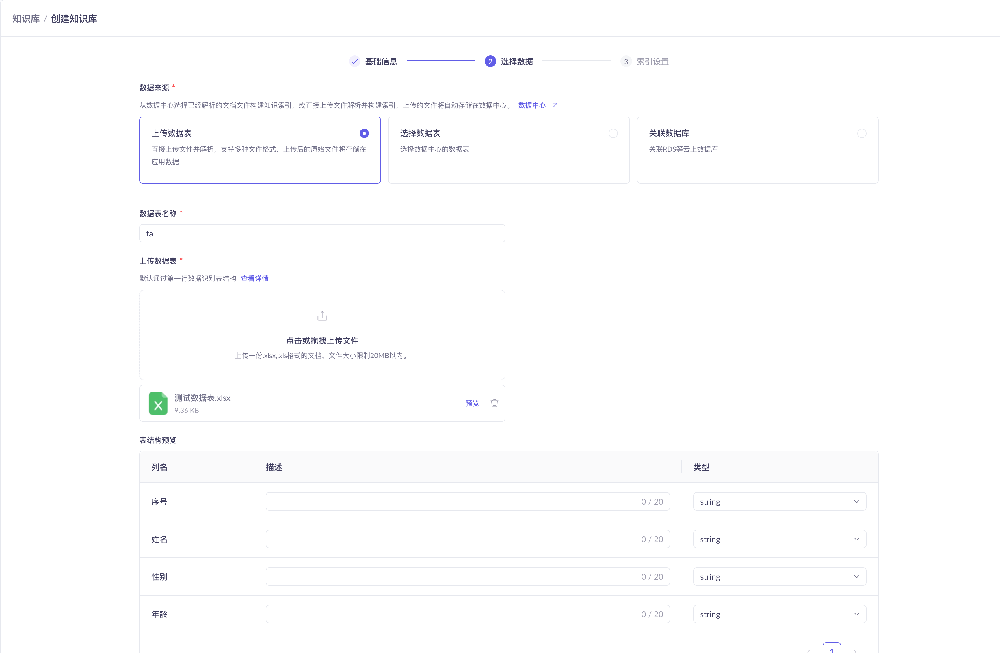

# 数据表RAG

用户通过上传excel(或csv)或填写数据库连接信息,自动解析(获取)schema。
上传文件通过DuckDB读取文件内容, 存储到阿里云OSS, 同时原文件存储到OSS, 并把文件元数据存储到mysql管理; 
若选择数据库数据, 输入是sql语句, 执行sql返回查询结果

## 前端页面

### 创建知识库

* 知识库名称(必填字段): 校验唯一
* 知识库描述(可选)
* 知识库类型(默认:数据查询, 有且只有该一个选项)


### 选择数据


* 数据来源(Choice Card实现)
  * 上传数据表: 支持excel、csv文件类型
    * 通过用户上传文件,自动解析文件里数据表schema
    * 表结构预览: 最终结果对应`t_dataset`表的`schema`字段
  * 远程数据表
    * 数据库类型: mysql
    * host: input框
    * port: input框(只支持数字)
    * username: input框
    * password: input框
    * database: input框
    * table: 用户填写完上述内容, 自动查询出table列表（select框, 单选, Combobox组件实现）

* 数据表名称(必填)
  * 上传数据表: 用户自定义
  * 数据库数据表: 默认查询的实际表名,也可用户自定义

* 表结构预览功能
  * 列名:
    * 上传数据表: 自动解析文件中schema
    * 数据库数据表: 通过连接数据库,读取schema
  * 描述:用户选填
  * 类型:支持string,long,double,datatime(yyyy-MM-dd HH:mm:ss)

### 索引设置

#### 上传数据表


##### 页面选择项
* 索引配置: 展示表schema
  * 字段名称
  * 字段类型
  * ~~参与检索: 开启后表示在此列数据中进行搜索~~
  * 参与回复: 开启后表示被搜索到的数据行对应的本列数据提取出来给到大模型进行生成
* ~~向量模型(Field组件实现)~~
  * ~~给出提示信息: 默认是`text-embedding-v4`~~
* ~~相似度阈值(0.00 ~ 1.00, 滑动条实现): 设定最低分数标准，只有超过这个阈值的检索结果才会被考虑用于后续的生成过程~~
* ~~最大召回数量(1 ~ 20): 滑动条实现~~

#### 远程数据表
无索引设置


## 后端功能

### 创建知识库流程


### 检索知识库数据流程


### 已存在的知识库,继续上传数据
> 此功能只对`上传数据表`(upload)类型知识库开放


### mysql表结构
```sql
-- 文件表
CREATE TABLE `t_file` (
    `id` varchar(100) NOT NULL DEFAULT '' COMMENT 'id',
    `type` varchar(50) NOT NULL COMMENT '文件类型: csv, excel',
    `name` varchar(100) DEFAULT NULL COMMENT '文件名称',
    `path` varchar(200) NOT NULL COMMENT '文件地址: oss路径',
    `size` bigint(20) DEFAULT NULL COMMENT '文件大小',
    `create_time` datetime NOT NULL DEFAULT CURRENT_TIMESTAMP COMMENT '创建时间',
    `update_time` datetime NOT NULL DEFAULT CURRENT_TIMESTAMP ON UPDATE CURRENT_TIMESTAMP COMMENT '更新时间',
    PRIMARY KEY (`id`)
) ENGINE=InnoDB DEFAULT CHARSET=utf8 COMMENT='文件表';
  
-- 知识库表
CREATE TABLE `t_dataset` (
    `id` varchar(100) NOT NULL DEFAULT '' COMMENT 'id',
    `name` varchar(100) DEFAULT NULL COMMENT '知识库名称',
    `description` varchar(200) NOT NULL COMMENT '知识库描述',
    `type` varchar(50) NOT NULL COMMENT '知识库类型: upload(文件上传), remote(远程数据库)',
    `table_schema` text NOT NULL COMMENT '数据表schema(json字符串)',
    `path` varchar(200) DEFAULT NULL COMMENT 'OSS路径',
    `create_time` datetime NOT NULL DEFAULT CURRENT_TIMESTAMP COMMENT '创建时间',
    `update_time` datetime NOT NULL DEFAULT CURRENT_TIMESTAMP ON UPDATE CURRENT_TIMESTAMP COMMENT '更新时间',
    PRIMARY KEY (`id`)
) ENGINE=InnoDB DEFAULT CHARSET=utf8 COMMENT='知识库表';

ALTER TABLE t_dataset ADD CONSTRAINT unique_name UNIQUE(name);

-- 知识库-文件映射表
CREATE TABLE `t_dataset_file` (
   `id` varchar(100) NOT NULL DEFAULT '' COMMENT 'id',
   `dataset_id` varchar(100) NOT NULL DEFAULT '' COMMENT '知识库id',
   `file_id` varchar(100) NOT NULL DEFAULT '' COMMENT '文件id',
   PRIMARY KEY (`id`)
) ENGINE=InnoDB DEFAULT CHARSET=utf8 COMMENT='知识库-文件映射表';
```

#### 字段说明

t_dataset表path字段: 若t_dataset.type是upload,则该字段存储数据表在oss的全路径; 若t_dataset.type是remote, 则该字段为null

t_dataset表schema定义:

##### upload类型
```json
[{
  "name": "字段名称-1",
  "type": "字段类型(string,long,double,datatime(yyyy-MM-dd HH:mm:ss))",
  "description": "用户定义字段描述"
},{
  "name": "字段名称-2",
  "type": "字段类型(string,long,double,datatime(yyyy-MM-dd HH:mm:ss))",
  "description": "用户定义字段描述"
}]
```

#### remote类型
```json
[{
  "name": "字段名称-1",
  "type": "原始字段类型",
  "description": "原始字段描述"
},{
  "name": "字段名称-2",
  "type": "原始字段类型",
  "description": "原始字段描述"
}]
```

## 限制
* 前端页面组件使用shadcn组件
